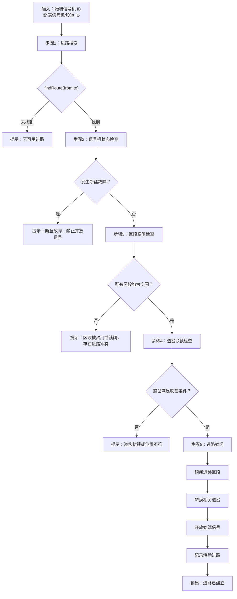
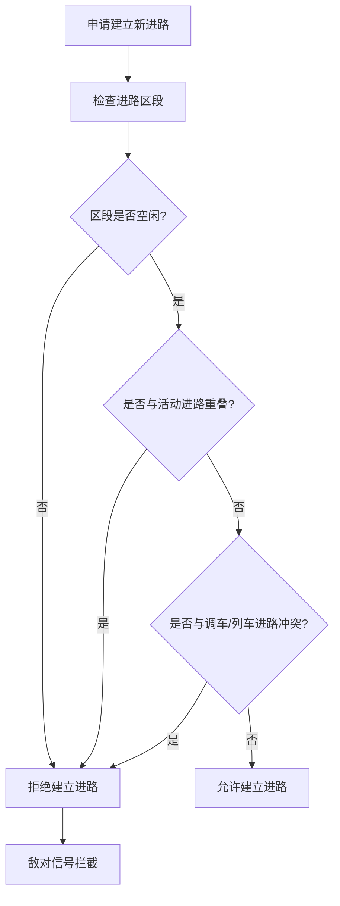
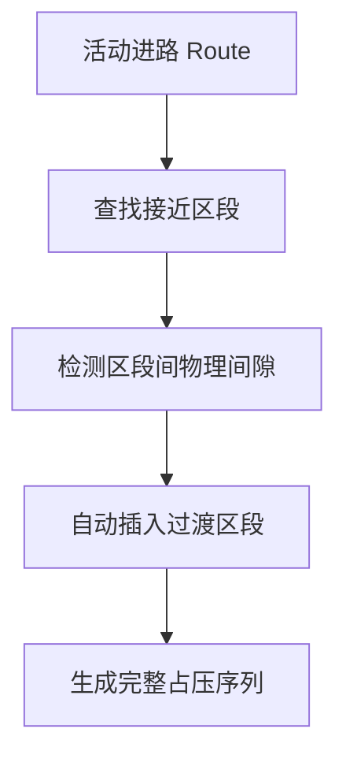
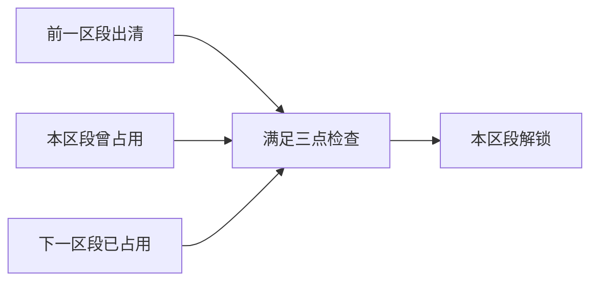
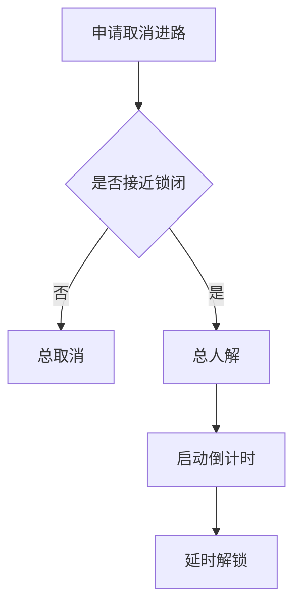
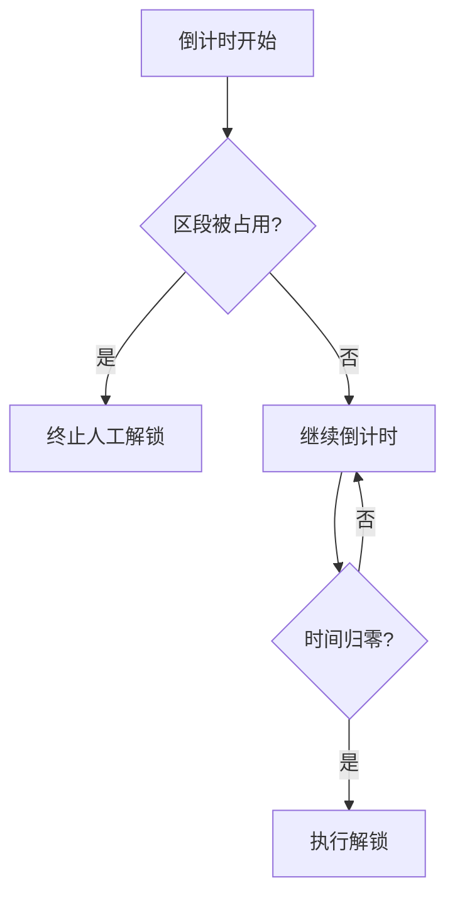

## 计算机联锁模拟仿真系统介绍文档

本报告阐述了基于 Web 前端架构的计算机联锁模拟仿真系统的设计与实现原理。系统以 Next.js 14 + TypeScript 为技术基底，采用分层架构将人机接口（HMI）、联锁逻辑（Interlocking Logic）与室外设备仿真（Simulation）三者解耦；以进路表为中心的状态机驱动联锁运算，实现进路搜索、道岔联锁检查、敌对信号拦截、三点检查解锁及接近锁闭等核心联锁逻辑。站场拓扑采用图—线段混合建模，覆盖接车、发车、通过及调车四大类进路，并配备安全线隔开装置与断丝故障注入等安全防护仿真。

 

### 一、引言

计算机联锁（Computer-Based Interlocking, CBI）是以计算机软件取代继电电路完成进路联锁运算的信号安全系统。其核心任务是在进路办理全过程中持续检查"区段空闲、道岔位置正确、敌对信号未开放"三大条件，并在列车占用及出清各轨道区段时执行逐段解锁，从而确保行车安全。

本系统以纯前端仿真方式实现上述联锁机理，运行于标准 Web 浏览器中，不依赖后端服务与真实硬件接口，旨在为铁路信号专业教学与功能验证提供一个可视化、可交互的联锁逻辑演示平台。

 

### 二、技术架构

#### 2.1 总体分层设计

系统采用三层架构，自顶向下依次为：

 

**三层架构及其职责**

| 层                  | 职责                                                         | 关键技术                                     |
| ------------------- | ------------------------------------------------------------ | -------------------------------------------- |
| HMI 控显层          | 站场拓扑绘制、操作事件捕获、状态可视化                       | React + SVG + useReducer 渲染驱动            |
| Interlocking 联锁层 | 进路建立/解锁判定、道岔联锁检查、敌对信号拦截、接近锁闭状态推导 | 纯函数状态机 + 进路表查表                    |
| Simulation 仿真层   | 轨道区段占用推移、道岔动作时间模拟、信号故障注入、人工解锁倒计时 | requestAnimationFrame + setInterval 时序驱动 |

 #### 2.2 状态管理机制

系统以 React 的 `useReducer` 为核心实现统一状态管理。全局状态 `State` 包含以下几个主要字段：

| 状态字段        | 说明                                           |
| --------------- | ---------------------------------------------- |
| `aspects`       | 信号机显示灯色映射                             |
| `switchPos`     | 道岔当前位置                                   |
| `switchLocked`  | 道岔单锁标记                                   |
| `switchBlocked` | 道岔封锁标记                                   |
| `segs`          | 轨道区段状态（`free` / `locked` / `occupied`） |
| `activeRoutes`  | 当前已建立的活动进路列表（含接近锁闭标记）     |
| `countdown`     | 人工解锁倒计时状态                             |
| `train`         | 模拟列车位置与运行状态                         |

状态结构示例如下：

```typescript
interface State {
  aspects: Record<string, Aspect>

  switchPos: Record<string, SwitchPos>

  switchLocked: Record<string, boolean>

  switchBlocked: Record<string, boolean>

  segs: Record<string, SegmentState>

  activeRoutes: ActiveRoute[]

  countdown: CountdownState | null

  train: TrainState | null
}
```

所有状态变更均通过 `reducer` 纯函数完成，确保状态迁移过程具有可预测性、可追溯性和一致性，从而提高联锁逻辑的可靠性与可维护性。


### 三、站场拓扑建模

#### 3.1 坐标系与坐标映射

站场图定义于 1200×440 的 SVG viewBox 坐标系中，以像素为逻辑单位。所有室外设备（信号机、道岔、区段、边界标识）均以绝对坐标定义。

#### 3.2 轨道区段模型

每个轨道区段由 SegmentDef 接口定义，核心字段为：

```typescript
interface SegmentDef {
 id: string; // 区段标识符，如 "1AG"、"IIG"
 path: Point[]; // 区段折线几何路径
 labelPos: Point; // 标签渲染位置
}
```

系统区段覆盖整个咽喉区域，包括：

| 区段 ID | 类型     | 功能                     |
| ------- | -------- | ------------------------ |
| IIAG_1  | 接近区段 | X进站信号机站外接近轨道  |
| IIAG_2  | 接近区段 | D1调车信号机接近轨道     |
| IIBG    | 接近区段 | S进站信号机站外接近轨道  |
| 1AG     | 咽喉区段 | D1至1号道岔之间轨道      |
| 2AG     | 咽喉区段 | 2号道岔至S信号机之间轨道 |
| IIIG    | 股道     | 3道                      |
| IIG     | 股道     | II道                     |
| IG      | 股道     | I道                      |

#### 3.3 道岔拓扑

五组道岔（W1~W5）构成咽喉区的轨线交叉节点。每组道岔以 SwitchDef 定义：

```typescript
interface SwitchDef {
 id: string;
 pivot: Point; // 道岔中心
 normalEnd: Point; // 定位（直向）末端
 reverseEnd: Point; // 反位（侧向）末端
}
```

状态空间为 {normal, reverse}，对应直向与侧向两条出岔路径。

#### 3.4 进路表建模

进路表是联锁逻辑的数据核心。每条进路由 RouteDef 定义：

```typescript
interface RouteDef {
  id: string;
  from: string; // 始端信号机 ID
  to: string; // 终端（信号机 ID 或股道 ID）
  kind: "train" | "shunt"; // 列车进路/调车进路
  segments: string[]; // 锁闭区段序列（按列车经过顺序）
  switches: {
    id: string;
    pos: "normal" | "reverse"; // 道岔要求
  }[];
  aspect: Aspect; // 始端信号开放灯色
  trainPath: Point[]; // 列车动画路径
}
```

系统进路表涵盖 19 条进路，按类型分为：

| 类别         | 数量 | 示例                                           |
| ------------ | ---- | ---------------------------------------------- |
| 下行接车进路 | 3    | X→IIG（正线）、X→IG（侧线）、X→IIIG（侧线）    |
| 上行接车进路 | 3    | S→IIG（正线）、S→IG（侧线）、S→IIIG（侧线）    |
| 通过进路     | 2    | X→S（下行通过）、S→X（上行通过）               |
| 下行发车进路 | 3    | XII→X、X1→X、X3→X                              |
| 上行发车进路 | 3    | SII→S、S1→S、S3→S                              |
| 调车进路     | 6    | D1→IIG、D1→IG、D1→IIIG、D2→IIG、D2→IG、D2→IIIG |

#### 3.5 安全线隔开装置

站场下行咽喉左侧设有安全线（SAFETY-LINE-L），作为接车进路的隔开设备。安全线由一段尽头式轨道构成，与相邻轨道之间通过 W5 道岔的侧向分支连接，能在接车进路终端未被占用时提供物理上的安全隔离，防止列车越出信号机后与其他进路发生侧面冲突。

此外，站场内 PZA 脱轨器作为辅助安全防护设备布置于下行咽喉底部，在工程实践中用于在调车作业中防止车列溜逸进入正线。


### 四、联锁原则的实现

#### 4.1 故障-安全原则（Fail-Safe）

系统在设计上遵循**故障-安全（Fail-Safe）原则**，即当设备发生故障或出现异常状态时，系统自动进入安全状态，防止产生危及行车安全的操作。具体实现如下：

1. **信号断丝故障**

   当信号机发生断丝故障时，信号显示自动熄灭。联锁系统禁止以该信号机作为始端办理进路，同时信号机无法开放，自动保持禁止信号状态（红灯），从而避免向列车发出错误的允许信息。

2. **人工解锁倒计时**

   对于已形成接近锁闭的进路，在执行人工解锁时，系统立即关闭始端信号机，但相关区段仍保持锁闭状态，道岔保持不可操纵。只有倒计时结束后才允许解锁，以确保接近列车有充足时间停车或进入进路后由正常走车解锁逻辑接管。

3. **人工解锁期间的进路入侵检测**

   在人工解锁倒计时过程中，系统持续监测进路内各轨道区段的占用状态。一旦发现列车进入进路，立即终止人工解锁流程，并切换至正常走车解锁模式，避免在列车运行过程中提前释放进路。

4. **列车暂停与解锁互斥**

   在人工解锁倒计时期间，系统禁止恢复列车运行。通过限制列车运行与解锁操作同时进行，避免出现时序竞争问题，保证联锁状态的一致性和安全性。

#### 4.2 进路建立流程

进路建立由始端信号机与终端信号机（或股道）的配对操作触发。系统通过 `tryBuildRoute()` 函数完成联锁检查与进路建立，其处理流程如下：



#### 进路建立后的处理

当所有联锁检查均通过后，系统执行以下操作：

1. 将进路涉及的轨道区段状态置为 `locked`（黄光带）。
2. 将相关道岔转换至进路要求的位置。
3. 开放始端信号机至规定灯色。
4. 将进路信息记录至 `activeRoutes`。
5. 输出日志信息：

```text
进路已建立，进路锁闭，信号开放
```

#### 4.3 道岔联锁检查

道岔联锁是进路建立过程中最重要的安全检查之一，其目的是确保列车运行路径上的所有道岔均处于正确且安全的状态。系统按照以下顺序执行联锁检查：

1. **封锁检查（最高优先级）**

   当道岔处于封锁状态时：

   ```typescript
   switchBlocked[id] === true
   ```

   无论当前道岔位置是否满足进路要求，系统均禁止任何进路使用该道岔。

   封锁功能主要用于模拟道岔施工、设备检修等特殊场景，确保维修期间不会误办理相关进路。

2. **单锁检查**

   当道岔处于单锁状态时：

   ```typescript
   switchLocked[id] === true
   ```

   系统将检查当前道岔位置是否与进路要求位置一致：

   - 位置一致：允许继续办理进路；
   - 位置不一致：拒绝建立进路。

   单锁功能用于固定道岔位置，以满足特定作业或运行需求。

3. **进路锁闭检查**

   当进路建立成功后，所有参与该进路的道岔自动纳入进路锁闭范围。

   系统在 `activeRoutes` 中记录当前进路涉及的全部道岔：

   ```typescript
   route.switches
   ```

   在进路锁闭期间：

   - 禁止对相关道岔执行单独操纵；
   - 禁止改变道岔位置；
   - 必须等待进路解锁后方可恢复操作。

   该机制能够防止列车运行过程中道岔被误操纵，从而保证进路完整性和行车安全。

#### 4.4 敌对信号拦截

敌对信号拦截是联锁系统保证行车安全的重要机制，其目的是防止两条存在冲突关系的进路同时建立。系统通过区段空闲检查和进路冲突检测机制，实现敌对进路的自动拦截。

具体包括以下三种情况：

1. **共线冲突**

   当两条进路共享同一轨道区段时，系统会在区段空闲检查阶段检测到冲突。

   若某区段已被活动进路锁闭：

   ```typescript
   segs[segmentId] === "locked"
   ```

   则任何试图使用该区段的新进路均会被拒绝建立，并提示区段冲突。

2. **重叠路径冲突**

   在咽喉区等轨道交叉密集区域，不同进路虽然起止点不同，但可能经过部分相同区段。

   当待建立进路的区段集合与已建立进路的锁闭区段存在交集时：

   ```typescript
   routeB.segments ∩ activeRoute.segments ≠ ∅
   ```

   系统判定两条进路存在路径冲突，拒绝建立新的进路。

3. **调车进路与列车进路互斥**

   调车进路和列车进路共享同一套轨道区段资源池。

   因此：

   - 调车进路可以阻止列车进路建立；
   - 列车进路也可以阻止调车进路建立；
   - 两者采用相同的锁闭检查规则；
   - 不设置额外优先级。

   系统遵循“先锁闭、先获得使用权”的原则，最先建立的进路拥有对应区段的独占使用权。

通过上述机制，系统无需单独维护敌对信号表，即可利用轨道区段锁闭状态实现敌对信号的自动拦截，从而保证站场运行安全。




### 五、核心逻辑算法

#### 5.1 三点检查解锁（Three-Point Check Release）

三点检查是进路逐段解锁的核心算法，其名称来源于以下三个时序条件：

- 前一区段已出清；
- 本区段曾被占用；
- 下一区段已被占用。

系统在 `TRAIN_TICK` 动作中完成区段状态迁移和逐段解锁。

##### 5.1.1 全占压序列构建

系统通过 `getFullOccupationSequence()` 构建列车完整占压序列。



例如：

```text
X → IIG

完整占压序列：

IIAG_1
→ IIAG_2
→ 1AG
→ IIG
```

##### 5.1.2 基于入口阈值的逐段推移

系统采用入口阈值法判断列车当前位置：

```typescript
for (const segment of fullSeq) {
  if (trainX >= segment.minX) {
    occupiedIdx = segment.index
  }
}
```

特点：

- 仅向前推进；
- 不会发生回退；
- 解决区段交界闪烁问题。

##### 5.1.3 状态迁移矩阵

| 条件     | occupiedIdx 与 i 的关系 | 区段状态      |
| -------- | ----------------------- | ------------- |
| 未到达   | occupiedIdx < i         | locked / free |
| 正在占压 | occupiedIdx = i         | occupied      |
| 已驶离   | occupiedIdx > i         | free          |

三点检查逻辑如下：



##### 5.1.4 出清解锁

当：

```text
t ≥ 1
```

表示列车已走完全程。

系统执行：

1. 释放全部区段；
2. 关闭始端信号；
3. 清除活动进路；
4. 输出解锁日志。

#### 5.2 接近锁闭逻辑（Approach Locking）

接近锁闭用于决定进路取消后的解锁方式。

##### 5.2.1 接近区段映射

```typescript
const APPROACH_SECTIONS = {
  X: "IIAG_1",
  D1: "IIAG_2",
  S: "IIBG"
}
```

##### 5.2.2 接近锁闭状态推导

```typescript
function isApproachLocked(
  fromSignalId,
  segStates
): boolean {

  const approachSeg =
    APPROACH_SECTIONS[fromSignalId]

  if (!approachSeg) {
    return false
  }

  return segStates[approachSeg] === "occupied"
}
```

系统重新计算：

```typescript
route.approached =
  route.approached ||
  isApproachLocked(route.from, segs)
```

一旦建立接近锁闭，不可撤销。

##### 5.2.3 解锁策略自动切换

| 条件               | 操作   | 解锁方式 | 解锁时机   |
| ------------------ | ------ | -------- | ---------- |
| approached = false | 总取消 | 立即解锁 | 立即释放   |
| approached = true  | 总人解 | 延时解锁 | 倒计时结束 |



##### 5.2.4 人工解锁倒计时



#### 5.3 进路搜索算法

采用直接查表法：

```typescript
function findRoute(
  from: string,
  to: string
): RouteDef | undefined {

  return ROUTES.find(
    r => r.from === from &&
         r.to === to
  )
}
```

搜索流程：

1. 点击始端信号机；
2. 点击终端信号机或股道；
3. 调用 `findRoute()`；
4. 返回匹配进路；
5. 未找到则提示无可用进路。

#### 5.4 信号显示逻辑

**信号开放规则**

| 进路类型 | 灯色   | 含义     |
| -------- | ------ | -------- |
| 正线接车 | 绿灯   | 允许通过 |
| 侧线接车 | 黄灯   | 减速进站 |
| 发车进路 | 绿灯   | 允许发车 |
| 通过进路 | 绿灯   | 允许通过 |
| 调车进路 | 月白灯 | 允许调车 |

**信号关闭条件**

信号机在以下情况自动关闭：

1. 总取消；

2. 人工解锁启动；

3. 列车出清；

4. 断丝故障。

   

### 六、仿真层实现

#### 6.1 列车运行仿真

| 参数     | 值            | 说明                  |
| -------- | ------------- | --------------------- |
| DURATION | 6500 ms       | 全程运行时间          |
| 帧率     | 约 60 fps     | requestAnimationFrame |
| 进度增量 | dt / DURATION | 时间驱动              |

#### 6.2 道岔动作仿真

```text
单操命令
→ movingSwitch
→ 延时500ms
→ SWITCH_SETTLE
→ 位置切换
→ 清除标记
```

#### 6.3 信号断丝故障仿真

故障注入后：

- 灯位熄灭；
- 禁止办理进路；
- 信号保持关闭状态。


### 七、结论

本系统采用纯前端架构实现计算机联锁核心功能，包括：

- 进路搜索；
- 联锁检查；
- 信号开放；
- 三点检查解锁；
- 接近锁闭；
- 人工解锁；
- 故障注入。

系统采用 HMI、联锁逻辑、设备仿真三层架构，并通过 `useReducer` 状态机统一管理联锁状态，能够满足铁路信号专业教学、实验验证和联锁原理演示需求，同时具备进一步扩展复杂站场和高级联锁逻辑的能力。